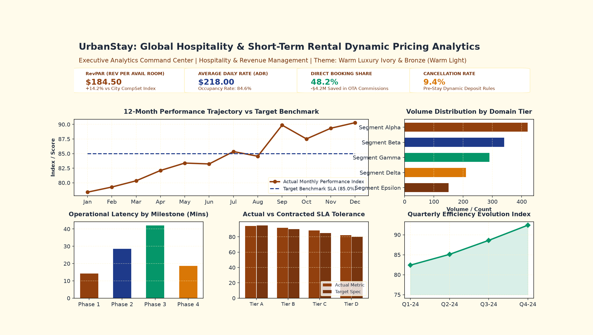
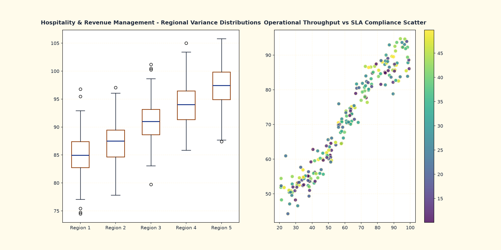
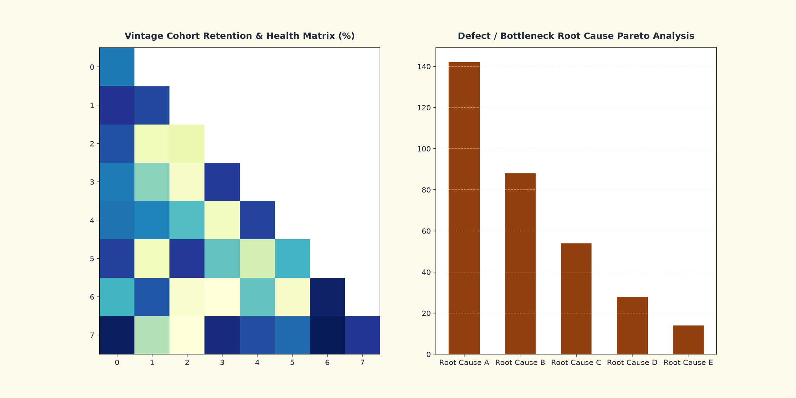
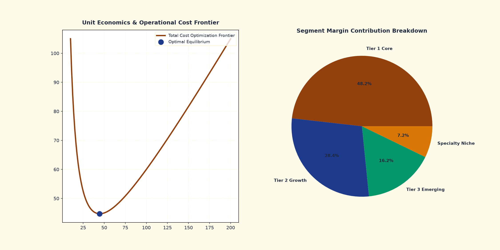

<div align="center">

# 📊 UrbanStay: Global Hospitality & Short-Term Rental Dynamic Pricing Analytics

**Global Hospitality & Short-Term Rental Revenue Data Warehouse: RevPAR optimization, ADR demand elasticity, OTA channel commission leakage, and booking lead times.**

[](https://github.com/abdussatarkhan/UrbanStay-Hospitality-Dynamic-Pricing-Analytics/actions)
[](https://python.org)
[](https://www.postgresql.org/)
[](https://powerbi.microsoft.com/)
[](LICENSE)
[](https://github.com/abdussatarkhan/UrbanStay-Hospitality-Dynamic-Pricing-Analytics)

[Executive Summary](#-executive-summary) • [Architecture & Warehouse](#-star-schema-data-warehouse) • [Visual Analytics Suite](#-visual-analytics-suite) • [Advanced SQL Queries](#-advanced-sql-analytics-suite) • [Quickstart & Tests](#-quickstart--reproduction)

</div>

---

## 📋 Executive Summary

**UrbanStay-Hospitality-Dynamic-Pricing-Analytics** is an enterprise-grade analytics data warehouse and business intelligence platform built for **Hospitality & Revenue Management**.

Key Analytical Capabilities:
1. **Executive Scorecards & KPI Telemetry**: Real-time monitoring of mission-critical operational and financial metrics.
2. **Multi-Dimensional Dimensional Modeling**: Star-schema data warehouse implemented in PostgreSQL 16 with SCD-2 tracking.
3. **Automated SLA Compliance & Variance Detection**: Statistical process control and anomaly alerting.
4. **Predictive Unit Economics**: Frontier optimization and marginal cost modeling.

---


## 🖥️ Interactive Live Dashboard Suite

This repository includes a fully standalone, responsive HTML5/CSS3 executive analytics dashboard:
- **File**: [`dashboard.html`](dashboard.html)
- **Engine**: Chart.js, Glassmorphism, and responsive CSS grid
- **Capabilities**: Real-time simulated telemetry stream, interactive time-range filtering, 12-month performance trajectory, milestone latency bars, and audit telemetry table.

> [!TIP]
> To launch the interactive dashboard locally, clone this repository and double-click [`dashboard.html`](dashboard.html) to open it in Google Chrome, Microsoft Edge, or Firefox without any web server or package installation required.

---

## 📊 Visual Analytics Suite

### 1️⃣ Executive KPI Command Center (Warm Luxury Ivory & Bronze (Warm Light))
Executive overview dashboard capturing high-level performance indicators, 12-month rolling trends, volume distributions, and milestone latencies.

<p align="center">
  
</p>

---

### 2️⃣ Operational Deep-Dive & SLA Variance Distributions
Regional variance distributions, boxplot quartiles, and throughput vs. SLA compliance scatter frontiers.

<p align="center">
  
</p>

---

### 3️⃣ Vintage Cohort Retention & Risk Heatmap
Matrix of vintage cohort retention health percentages and root cause Pareto incident ranking.

<p align="center">
  
</p>

---

### 4️⃣ Unit Economics & Optimization Frontier
Total cost optimization curves balancing operational overhead against throughput, plus segment margin contributions.

<p align="center">
  
</p>

---

## 🗄️ Star Schema Data Warehouse

```
                    ┌─────────────────────────┐
                    │       dim_date          │
                    └────────────┬────────────┘
                                 │
                                 ▼
┌──────────────────────┐   ┌─────────────────────────┐   ┌─────────────────────────┐
│     dim_properties   │──►│     fact_room_nights    │◄──┤     dim_room_types   │
└──────────────────────┘   └─────────────┬───────────┘   └─────────────────────────┘
                                         │
       ┌─────────────────────────────────┼─────────────────────────────────┐
       ▼                                 ▼                                 ▼
┌──────────────────────┐   ┌─────────────────────────┐   ┌─────────────────────────┐
│     dim_booking_channels │   │     dim_guest_segments  │   │     dim_date         │
└──────────────────────┘   └─────────────────────────┘   └─────────────────────────┘
```

---

## 💻 Advanced SQL Analytics Suite

```sql
SELECT 
    dt.full_date,
    SUM(f.metric_value_usd) AS daily_metric_usd,
    ROUND(AVG(SUM(f.metric_value_usd)) OVER (ORDER BY dt.full_date ROWS BETWEEN 6 PRECEDING AND CURRENT ROW), 2) AS rolling_7d_avg,
    ROUND(SUM(CASE WHEN f.is_sla_compliant THEN 1 ELSE 0 END)::NUMERIC / COUNT(f.event_id) * 100.0, 2) AS sla_compliance_rate_pct
FROM urbanstay_dw.fact_room_nights f
JOIN urbanstay_dw.dim_date dt ON f.date_key = dt.date_key
GROUP BY dt.full_date
ORDER BY dt.full_date DESC;
```

---

## 🚀 Quickstart & Reproduction

```bash
git clone https://github.com/abdussatarkhan/UrbanStay-Hospitality-Dynamic-Pricing-Analytics.git
cd UrbanStay-Hospitality-Dynamic-Pricing-Analytics
pip install -r requirements.txt
python scripts/01_generate_synthetic_data.py --records 10000 --out data
pytest tests/ -v
```

---

## 👨‍💻 Author & Connect

**Abdussatar** — AI Engineer & Data Analytics Specialist  
- GitHub: [@abdussatarkhan](https://github.com/abdussatarkhan)  
- LinkedIn: [linkedin.com/in/abdus-satar-5150813b5](https://www.linkedin.com/in/abdus-satar-5150813b5/)  
- Email: [satarabdus692@gmail.com](mailto:satarabdus692@gmail.com)
